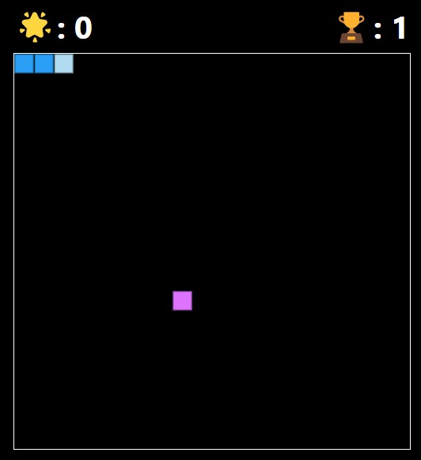

# Snake-Game

### Description
This game is a classic single-player Snake Game, which was built using HTML, CSS AND JavaScript. The objective of the game is simple: control the snake's movement using arrow keys, make it grow in length by consuming food, and avoid collisions with the boundaries of the game area.

### Game View

### How to Play
- Use the arrow keys (up, down, left, right) to control the direction of the snake.
- Guide the snake to eat the food represented by a distinct colored square.
- Every time the snake consumes food, it will grow longer making the score increase.
- The game will come to an end when the snake hits the boundary or collides with itself.

